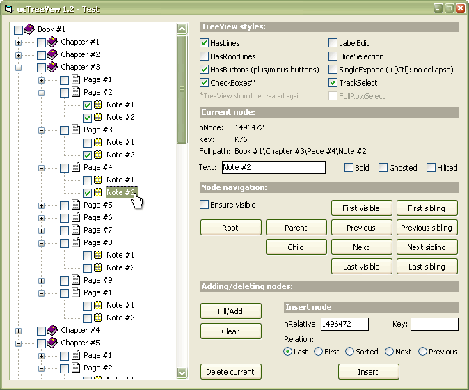



## API\-ucTreeView 1\.2

### Description

Almost single-module TreeView user-control (thanks, Paul). // Zip 32Kb.
 
### More Info
 

             |
---                |---
**Submitted On**   |2004-10-27 16:05:14
**By**             |[Carles P\.V\.](https://github.com/Planet-Source-Code/PSCIndex/blob/master/ByAuthor/carles-p-v.md)
**Level**          |Intermediate
**User Rating**    |5.0 (145 globes from 29 users)
**Compatibility**  |VB 6\.0
**Category**       |[Custom Controls/ Forms/  Menus](https://github.com/Planet-Source-Code/PSCIndex/blob/master/ByCategory/custom-controls-forms-menus__1-4.md)
**World**          |[Visual Basic](https://github.com/Planet-Source-Code/PSCIndex/blob/master/ByWorld/visual-basic.md)
**Archive File**   |[API\-ucTree1887955132005\.zip](https://github.com/Planet-Source-Code/carles-p-v-api-uctreeview-1-2__1-56958/archive/master.zip)

